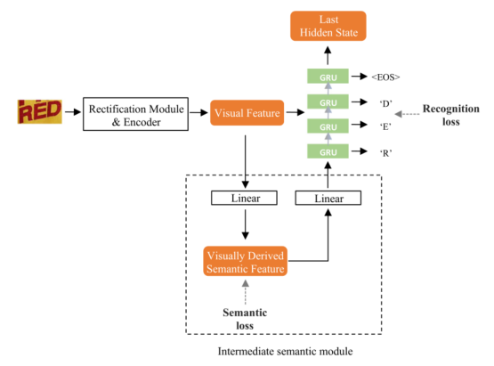
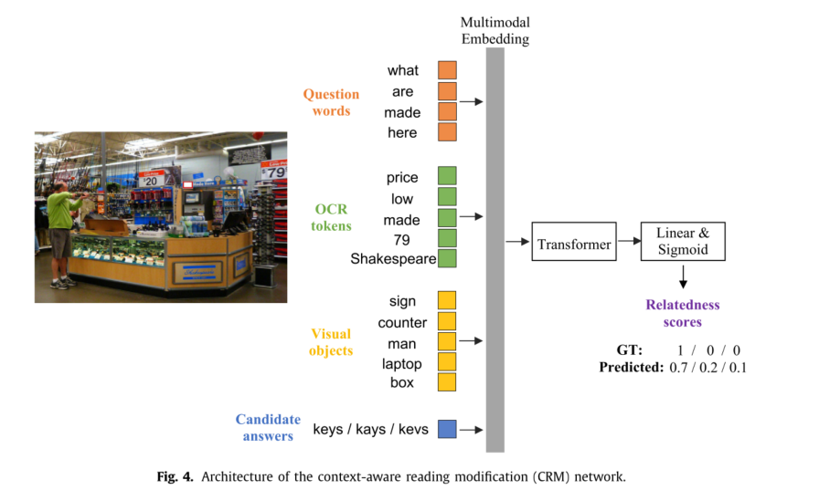
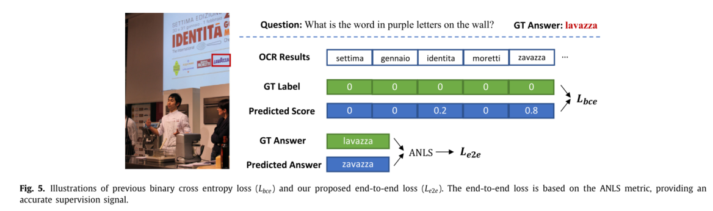
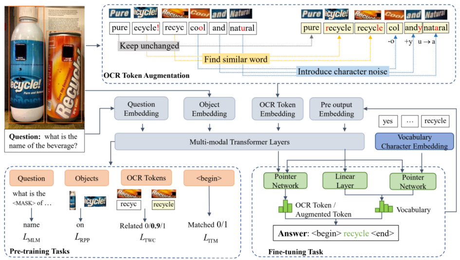
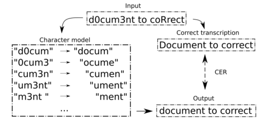

### 论文用于处理OCR问题

## Beyond OCR + VQA: Towards end-to-end reading and reasoning for robust and accurate textvqa 

超越OCR+VQA：实现端到端阅读和推理，实现稳健准确的文本VQA 

不准确的OCR结果会导致错误的累积传播，且文本阅读和基于文本的推理之间的相关性没有得到充分利用。本文旨在是按**OCR与VQA任务的相互强化**，提出了一种视觉增强的文本嵌入模块，用于从文本的视觉信息中预测语义特征。开发了两个方案用于利用VQA中的上下文信息来修改OCR结果。

第一个方案是阅读修改模块，该模块根据上下文自适应地选择答案结果；第二个方案是一种高效的端到端文本阅读和推理网络，下游vqa信号有助于优化文本阅读。

### **三点贡献：**

1. 本文认为OCR不仅是TextVQA预处理模块，也是使TextVQA与传统VQA不同的关键模块。通**过将OCR集成到TextVQA的流程中，OCR模块与VQA模块相互加强**，有效缓解OCR准确性差对场景推理和问答的限制。
2. 为了抑制OCR错误引起的积累错误传播，提出了**一种视觉增强的文本嵌入模块**（visual enhanced text embedding module），以增强特征表示的鲁棒性以提高推理能力。
3. 为了细化答案预测结果，利用下游推理中的上下文信息来促进文本阅读，在没有 gt OCR注释下，本文设计了一个上下文感知阅读修改模块来修复回答步骤中的OCR错误。当OCR gt可用时，将训练一个有效的端到端网络，通过反馈路径修改阅读结果。

### 本文提出的问题：

现在的大部分方法只是将OCR和VQA模块级联，因此它们受到文本阅读性能的显著限制（严重受限于OCR模块的准确度）

多模态输入和之前的方法一致，

1. question输入：对于问题（question）使用预训练的BERT模型生成问题词嵌入；

2. 视觉对象：Faster R-CNN

   

3. OCR对象：一个OCR module用于检测和识别N个OCR tokens。基于识别的结果，提供了多个特征，本文提出了视觉衍生的文本嵌入，用于补充常见的语言嵌入。设计了一个**文本相关的视觉到语义映射网络（TVS）**，直接从文本区域的视觉信息总获得语义嵌入。

最终视觉增强文本嵌入公式化为
$$
x^{txt}_{n}=LN(W_4x^v_n+W_5x^{ft}_n+W_6x^{p}_{n}+W_7x^{fr}_{n})+LN(W_8x^b_{n})
$$
什么意思呢，W都是可学习的投影矩阵，W4的x是表示视觉衍生的文本嵌入，W5的x表示FastText的特征（文本分类），W6表示PHOC（**Pyramidal Histogram of Characters** 字符直方金字塔），W7表示OCR Faster rcnn特征，W8表示OCR边界框特征。

#### 跨模态融合

Transformer encoder将来自上述三种模态的所有特征都投影到共同的d维嵌入空间，模态间和模态内的交互通过一堆变化层来实现。

#### Answer prediction decoder

M4C

#### 创新网络

（1）BOV R++

（encoder不变）在解码器开发了一个上下文感知阅读修改模块（CRM） ，在答案解码步骤预测到OCR tokens，通过后处理器CRM来修改其结果；

（2）BOV E++

用端到端的方式级联OCR与VQA模块，下游VQA可以向OCR模块提供反馈，并在训练过程中逐渐验证OCR结构和特征。

#### 视觉增强文本嵌入

TVS结构

（1）校正模块和编码器（左边）

校正失真文本图像并提取视觉特征

（2）基于GRU decoder预测识别结果

（3）中间语义模块，用于预测单词的全局语义层

CRM结构

尽管textvqa的推理能力得到了增强，但最终答案预测性能任然高度依赖于OCR模块的准确度。利用（CRM）上下文感知阅读修改模块，改善OCR复制答案。   这是一个后处理器，放在decoder后。

如果解码的答案指向一个OCR标记则为**其准备多个识别的候选词，选择那个候选词是最合适的**。同样这个也是一个Transformer，和一个二分类器结合使用。

**CRM的目标是确定当前情况下哪一个候选词是合适的**，

比如，使用Rosetta en作为OCR模块，并提供第一个候选的识别结果。利用预训练的TVS来识别相同的文本区域，rank1和rank2作为提供第二和第三的候选结果。如果一个候选的结果与gt的答案相同，则将其作为正样本。

**端到端训练**

该模块提供了一种利用下游上下文线索帮助OCR校正。促进文本阅读和基于文本的推理之间的充分信息交互。将文本阅读的多模态特征纳入TextVQA的训练流程。动态提取OCR结果和特征，打破性能瓶颈。

损失设置

## From Token to Word: OCR Token Evolution via Contrastive Learning and Semantic Matching for Text-VQA（TWA）

从标记到单词：基于对比学习和文本语义匹配的OCR标记进化VQA 

OCR系统中的文本通常包含拼写错误，例如“pepsi”被识别为“peosi”。这些OCR错误是文本VQA系统面临的主要挑战之一。为了解决这一问题，我们提出了一种新的文本VQA方法，通过OCR令牌进化来减轻OCR错误。首先，我们在训练时间内人**为地创建拼写错误的OCR令牌，使系统对OCR错误更加鲁棒。具体来说，我们提出了一种OCR标记词对比（TWC）学习任务，该任务通过OCR标记与词典中单词之间的Levenstein距离来增强OCR标记，从而预训练单词表示。**

通过假设拼写错误的OCR令牌中的大多数字符仍然正确，提出了一种多模式转换器，并对其进行了微调，以使用基于字符的单词嵌入来预测答案。具体来说，我们引入了一种具有字符级语义匹配的词汇预测器，即使有拼写错误的OCR标记，该模型也能从词汇中恢复正确的单词。

### 提出两个问题：

1、学习更健壮的OCRtoken表示，当token中存在一些字符错误，应该如何传达正确的语义？两个错误的词比如‘peosi’和‘pepsi’有什么相关性？

2、如何在OCRtoken和单词之间建立正确的联系，使用拼写错误的OCR令牌进一步推断正确的答案？从词汇表中恢复正确的单词。

### 本文贡献

1、提出了一种新的textvqa框架，用于拼写错误的OCRtoken

2、人工模拟OCR错误，提出了一种OCR标记字 对比学习训练OCR标记的容错表示，帮助推理；

3、提出了一种用于字符级语义匹配的词汇预测器，即使有拼写错误的OCR标记，该模型也能从词汇中恢复正确的单词。 

TWC（OCRtoken-单词对比学习）的任务，该任务通过计算OCRtoken和单词之间的Levenshtein距离增强OCRtoken，从而达到预训练OCRtoken的目的。

给定一个图像和一个问题，使用预训练的OCR模型和obj检测模型对图像进行预处理，获取图像中的文本和对象。使用单词embedding、字符embedding和OCR模型的置信分数来学习OCRtoken的表示。

本文的自监督任务为OCRtoken对比学习任务，在每一步，模型都会从迭代的解码器中预测答案。具体而言，模型从**图像中的OCR标记**、**增强标记**、**训练数据中的常用词词汇表**选择一个单词。由于OCRtoken不总是正确的，本文假设拼写错误的OCRtoken中的大多数字符是正确的，使用基于字符的单词嵌入。

上面这张图我们可以看出，主要改进有三点：

1、干扰字典中的一些字符（比如减少cool->col增加and->andy修改。。。）等方法模拟OCR错误，从而增强OCRtoken。

2、软标签监督OCR标记词对比学习，与其他的预训练任务一起训练。使用迭代解码器进行微调。

3、模型从**图像中的OCR标记**、**增强标记**、**训练数据中的常用词词汇表**选择一个单词，并引入具有字符级语义匹配的指针网络。

### 多模态方法

question->BERT 

物体外观特征、边界框坐标->Faster RCNN

OCR：

视觉特征->$$x_{n}^{vis}$$

边界框坐标->$$x_{n}^{bbox}$$

FastText分类特征->$$x_{n}^{ft}$$

金字塔字符直方图特征->$$x_{n}^{phoc}$$

本文提出的语义表征->$$x^{semantic}$$

OCRtoken嵌入：
$$
x_{n}^{ocr}=LN(W_{3}x_{n}^{vis}+W_{4}x_{n}^{phoc}+W_5x_{n}^{ft})+LN(W_6x_{n}^{bbox})+x_n^{semantic}
$$
最后那个任务如何实现呢？

输入OCRtoken特征与增强的OCRtoken特征，目标是预测每个（OCRtoken，增强token）是否相关。对于每个对，计算token-to-word和word-to-token的相似性。

### fineturn

这里没啥变化，迭代解码的单词来自以下三种：图像中的OCRtoken、增强的token、训练数据的频繁的anwser词汇表。在解码的每一步，首先输入先前预测的单词进行嵌入，并基于transformer预测下一个anwser的单词

好好好，下一篇

## Seeing Out of tHe bOx: End-to-End Pre-training for Vision-Language Representation Learning（SOHO）

走出困境：视觉语言表征学习的端到端预训练 

不需要边界框注释？通过促进跨模态的视觉词典（VD）学习全面紧凑的视觉特征。预训练任务掩蔽视觉建模（MVM）

不行，不能用fasterrcnn

## Large-Scale Adversarial Training for Vision-and-Language Representation Learning 

视觉和语言表征学习的大规模对抗性训练 

两个训练阶段：

1、任务不可知的（不知道啥是VQA）的对抗性预训练；

2、特定任务的对抗性微调

在每个模态的嵌入空间中加入对抗训练，而不是像素和文本标记上的对抗扰动

## Post-OCR Document Correction with large Ensembles of Character Sequence-to-Sequence Models

利用大型字符序列集合对序列模型进行OCR后文档校正 

这篇是做文档OCR的。

我们提出了一种**基于字符序列模型的任意长度文档校正新方法**。我们方法的新颖之处在于**在短窗口上训练字符序列模型，以检测错误并同时生成候选更正**，而不是像OCR后文本更正系统那样，首先找到错误，然后使用字典或语言模型进行更正。

 1、第一个主要思想是使用序列模型来校正文档的n-gram，而不是将整个文档作为单个序列。以这种方式，可以有效地处理文档，因为并行地校正了n-gram

2、将所有n元校正组合成一个输出，这一过程为该技术增加了鲁棒性，相当于使用大量序列模型的集合，其中每个模型作用于不同的片段。 

3、我们的方法不依赖于预训练的语言模型，这使得它适用于低资源设置而不牺牲性能。 

在合并步骤之后，可以使用字符错误率将最终输出与正确的转录进行比较。 

本文系统的核心是一个标准的seq2seq的模型，可以校正字符序列。用了一个transformer呢。将文档中的一段字符作为数据进行校正。为了训练这个序列模型，有必要将原始文档与其相应的正确转录对齐，这并不总是简单的。由于输出的长度不一定与输入的长度相同（因为可能插入或删除字符），因此需要像贪婪搜索或波束搜索这样的解码方法来根据模型生成最有可能校正的序列。

本文采取的长度维5的n-gram的牛逼方法：

n-gram变化的一个重要部分是如何组合部分输出。由于部分校正的偏移量为1，因此可以通过对齐输出并进行投票来组合输出，以获得每个位置最可能的字符。这种投票相当于用n个模型的集合来处理整个输入，每个模型都在偏移量为1的段上操作，其中n是n-gram的阶数。由于在n-gram中间更正了一个字符 。（投票过程省略）

。。。什么玩意。做过实验嘛