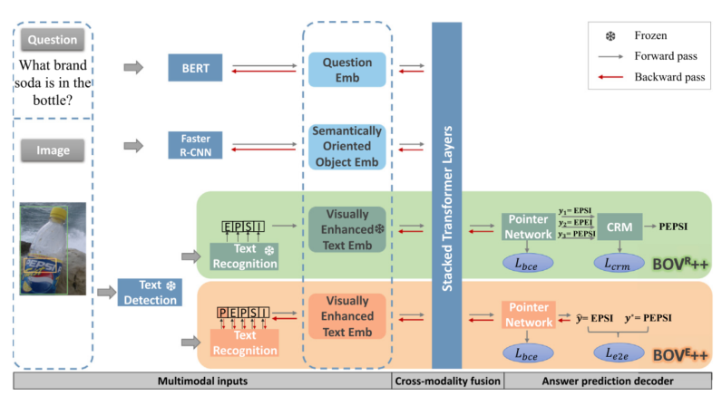

### 论文用于处理OCR问题

## Beyond OCR + VQA: Towards end-to-end reading and reasoning for robust and accurate textvqa 

超越OCR+VQA：实现端到端阅读和推理，实现稳健准确的文本VQA 

不准确的OCR结果会导致错误的累积传播，且文本阅读和基于文本的推理之间的相关性没有得到充分利用。本文旨在是按**OCR与VQA任务的相互强化**，提出了一种视觉增强的文本嵌入模块，用于从文本的视觉信息中预测语义特征。开发了两个方案用于利用VQA中的上下文信息来修改OCR结果。

第一个方案是阅读修改模块，该模块根据上下文自适应地选择答案结果；第二个方案是一种高效的端到端文本阅读和推理网络，下游vqa信号有助于优化文本阅读。

### **三点贡献：**

1. 本文认为OCR不仅是TextVQA预处理模块，也是使TextVQA与传统VQA不同的关键模块。通**过将OCR集成到TextVQA的流程中，OCR模块与VQA模块相互加强**，有效缓解OCR准确性差对场景推理和问答的限制。
2. 为了抑制OCR错误引起的积累错误传播，提出了**一种视觉增强的文本嵌入模块**（visual enhanced text embedding module），以增强特征表示的鲁棒性以提高推理能力。
3. 为了细化答案预测结果，利用下游推理中的上下文信息来促进文本阅读，在没有 gt OCR注释下，本文设计了一个上下文感知阅读修改模块来修复回答步骤中的OCR错误。当OCR gt可用时，将训练一个有效的端到端网络，通过反馈路径修改阅读结果。

### 本文提出的问题：

现在的大部分方法只是将OCR和VQA模块级联，因此它们受到文本阅读性能的显著限制（严重受限于OCR模块的准确度）

多模态输入和之前的方法一致，

1. question输入：对于问题（question）使用预训练的BERT模型生成问题词嵌入；

2. 视觉对象：Faster R-CNN

   

3. OCR对象：一个OCR module用于检测和识别N个OCR tokens。基于识别的结果，提供了多个特征，本文提出了视觉衍生的文本嵌入，用于补充常见的语言嵌入。设计了一个**文本相关的视觉到语义映射网络（TVS）**，直接从文本区域的视觉信息总获得语义嵌入。

最终视觉增强文本嵌入公式化为
$$
x^{txt}_{n}=LN(W_4x^v_n+W_5x^{ft}_n+W_6x^{p}_{n}+W_7x^{fr}_{n})+LN(W_8x^b_{n})
$$
什么意思呢，W都是可学习的投影矩阵，W4的x是表示视觉衍生的文本嵌入，W5的x表示FastText的特征（文本分类），W6表示PHOC（**Pyramidal Histogram of Characters** 字符直方金字塔），W7表示OCR Faster rcnn特征，W8表示OCR边界框特征。

#### 跨模态融合

Transformer encoder将来自上述三种模态的所有特征都投影到共同的d维嵌入空间，模态间和模态内的交互通过一堆变化层来实现。

#### Answer prediction decoder

M4C

#### 创新网络

（1）BOV R++