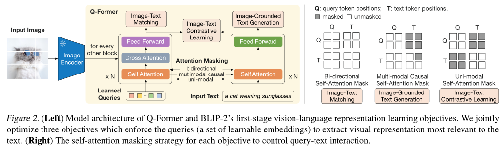

# blip-2

首先是网络结构（Q-Former）这个网络参考ALBEF，在之基础上引入Learned Query。可以看到这些Query通过Cross-Attention与图像的特征交互，通过Self-Attention与文本的特征交互。这样做的好处有两个：（1）这些Query是基于两种模态信息得到的；（2）无论多大的视觉Backbone，最后都是Query长度的特征输出，大大降低了计算量。

针对Q-Former的三个训练任务分别是 Image-Text Contrastive Learning (ITC)，Image-grounded Text Generation (ITG)，Image-Text Matching (ITM)。其中 ITC 和 ITM 任务，与ALBEF中的实现类似，只不过图像特征改为了Query的特征，具体可以参考代码实现（[ITC](https://link.zhihu.com/?target=https%3A//github.com/salesforce/LAVIS/blob/3ac397aa075c3e60b9521b012dda3660e3e35f1e/lavis/models/blip2_models/blip2_qformer.py%23L125)和[ITM](https://link.zhihu.com/?target=https%3A//github.com/salesforce/LAVIS/blob/3ac397aa075c3e60b9521b012dda3660e3e35f1e/lavis/models/blip2_models/blip2_qformer.py%23L160)）。这里比较特别的是ITG任务，与ALBEF中的MLM不同，这里改成了生成整句Text的任务，类似Captioning，具体代码实现[ITG](https://link.zhihu.com/?target=https%3A//github.com/salesforce/LAVIS/blob/3ac397aa075c3e60b9521b012dda3660e3e35f1e/lavis/models/blip2_models/blip2_qformer.py%23L228)。实际上，这几个任务都是以Query特征和文本特征作为输入得到的，只不过有不同的Mask组合，具体可以参考上图中的右图。

blip通过两个阶段进行预训练，第一个阶段通过冻结的图像编码器和**查询转化器**引导**视觉语言表示学习**，第二阶段从冻结的语言模型中引导**视觉语言生成学习**。

为了实现与冻结的单峰模型（unimodal models）的视觉语言对齐，将一组查询嵌入作为图像转化器的输入。查询通过自注意力层交互，并通过交叉关注层与冻结的图像特征交互。对于Q-Former，初始化的是Bertbase，交叉注意层被随机初始化。Q-Former包含188M个参数。

使用32个查询，每个查询的维度是768（也是TAP中TEXT-BERT-HIDDEN-SIZE）

**ITC**

学习对齐图像表示和文本表示，使得他们的相互信息最大化。

对齐方法：将来自图像转换器的输出查询表示Z与来自文本转换器t对齐，其中t是[CLS]标记的输出嵌入，由于Z包含多个输出嵌入（每个查询一个），本文首先计算每个查询输出与t之间的成对相似性，然后选择最高的一个作为图像文本相似性。为了避免信息泄露，我们使用了一个单峰自注意掩码，其中查询和文本不允许相互看到。

