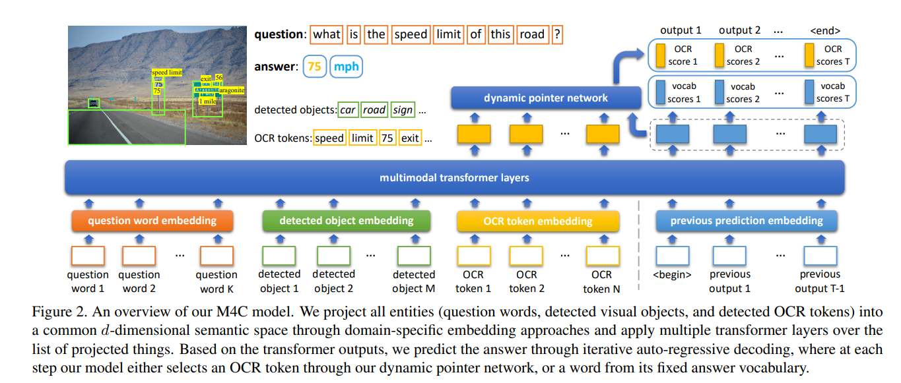
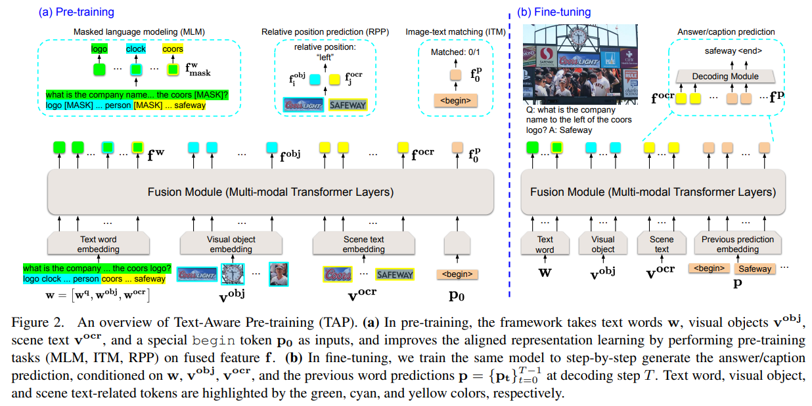

# 场景文本VQA复习

做毕设去了，最近有时间复习一下

~~建议周五之前弄完~~

## M4C

Iterative Answer Prediction with Pointer-Augmented Multimodal Transformers for TextVQA

TextVQA任务：模型可以**看到、阅读、推理**三种模态：**输入问题**、**图像中的视觉内容**、**图像中的文本**

根据以上内容，模型可以推理出答案。

### 特征表示

**question：**BERT-base模型作为encoder，只用前3层得到矩阵**shape=(K,d)**

**detected obect：**两部分

- Faster RCNN特征

- 位置特征

其实就是两个坐标，分别是左上角的坐标和右下角的坐标，画一个锚点框（这种技术是不是太古老了？）
$$
[x_{min}/W_{im},y_{min}/H_{im},x_{max}/W_{im},y_{max}/H_{im}]
$$
这是一个四维的位置特征，W与H分别为图像的宽度与高度

融合方式：分别经过Linear层，再通过一层LayerNorm，再加起来。
$$
x_{m}^{obj}=LN(W_1x_{m}^{fr})+LN(W_2x_{m}^b)
$$
W1与W2是学习的投影矩阵。LN是层归一化，加在线性变换的输出上，以确保对象嵌入与**question embedding具有相同的规模**    得到矩阵**shape=(M,d)**

**OCR tokens：**四部分

- 300维FastText特征
- Faster RCNN特征，与detected object获取方式相同
- 604维Pyramidal Histogram of Characters（PHOC）特征
- 4维的位置特征，计算方式与detected object一致

融合方式：FastText、rnn、PHOC特征（前三个）做Linear变化后相加，在进行LayerNorm，最后的位置特征单独进行做Linear变化后，在进行LayerNorm相同操作。最后把两个结果加起来。
$$
x_{n}^{ocr}=LN(W_3x_{n}^{ft}+W_4x_{n}^{fr}+W_5x_{n}^{p})+LN(W_6x_{n}^{b})
$$
得到矩阵**shape=(N,d)**

### 模型

对于模型的输入，我们可以看到，除了question、detected object、ocr以外，还有以前的Transformer的output输出（decoder），将这四个特征拼接起来得到最终输入到transformer内部的特征。

输入question、detected object、ocr特征：
$$
x_{k}^{ques},x_{m}^{obj},x_{n}^{orc}
$$
之前transformerdecoder特征：
$$
x_{t}^{dec}
$$
将这四个模块进行拼接，得到最终的**shape=(k+m+n+p,d)**，p是当前的时间步，也可以理解为已经预测的答案数量。初始为1，也就是最前面的<begin>字符

输入transformer中得到的输出矩阵**shape=(k+m+n+p,d)**

### Dynamic pointer network

DPN模块指导模型从fixed vocab中选出一个单词来？还是从ocr中选一个单词出来。对两个词库进行概率分布建模。

由于编码是迭代的，假设当前时间步为t。

**从fixed vocab中选择：**对于vocab中的第i个词，它的得分如下：
$$
y_{t,i}^{voc}=(w_{i}^{voc})^Tz_{t}^{dec}+b_{i}^{voc}
$$
其中z是上面x对应的输出。w是一个可学习的参数。

**从ocr中选择**：对于ocr里的第n个词，得分计算方式如下。
$$
y_{t,n}^{ocr}=(W^{ocr}z_{n}^{ocr}+b^{ocr})^T(W^{dec}z_{t}^{dec}+b^{dev})
$$

### 实验

使用d=768作为联合嵌入空间的维度，用BERT-BASE提取问题词特征，使用其前三层的768维输出，在训练期间进行微调。

在视觉基因组数据集上预训练Faster R-CNN检测器检测对象（这个可以暂时不用考虑），每张图像上保留100个得分最高的对象，从每个检测到的目标中提取fc6特征向量。我们在提取的fc6特征上应用Faster R-CNN fc7权重来输出2048维的fc7外观特征，并在训练过程中对fc7权重进行微调。M4C采用的是**Rosetta OCR系统**在每张图片上提取文本token，从每个OCR token中提取FastText、Faster R-CNN外观特征、PHOC特征、bounding boxes（bbox）特征（300 (FastText) + 604 (PHOC) + 2048 (Faster R-CNN) + 100 (all zeros; legacy)）

transformer中使用L=4层数为4的多模态transformer，12个注意力头，我们从训练集的答案中收集最频繁的5000个词作为我们的答案单词表。在训练过程中，我们使用128的批次量，最多可训练24,000次迭代。我们的模型使用Adam优化器进行训练，学习率为1e-4，采用阶梯式学习率计划，在14000次和19000次迭代时，我们将学习率乘以0.1。

## TAP

Text-Aware Pre-training for Text-VQA and Text-Caption

模型结构：

这方面与M4C相似，视觉语言预训练（VLP）在学习任务中不可知的图像和文本联合表示方面表示出了很强的有效性。 主要思想包括：在图像字幕数据集上使用预训练任务对模型进行预训练，针对特定的视觉语言任务微调模型。**但是传统VLP方法是为视觉语言任务直观地设计地，并在预训练中不包括场景文本，无法捕捉场景文本模态及其与视觉和文本模态之间的关系（3模态）**

Tap提出了文本感知预训练（TAP），它在预训练中结合了场景文本模态，以学习文本单词、视觉对象和场景文本的联合表示。在TAP中，我们设计了文本感知的预训练任务，以更好地将场景文本（包括场景文本单词及其通过OCR检测到的视觉区域）与文本单词和视觉对象融合在一起。

**question文本编码器**：

3层文本编码器 4层多模态编码器

未完待续，还有latr和新论文，以及TAG

下周开始看代码