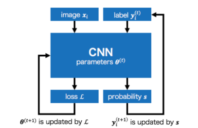

## 问题

1、出现txt_delta grad为None的问题：对于pytorch 有个概念叶子节点，一般用户自己创建的变量叫叶子节点，而叶子节点经过计算得到的变量叫非叶子节点，叶子节点的梯度值不为none, 非叶子节点的梯度值没有保存在内存中，所以对非叶子节点进行求梯度则为none；（搞错模型了）

2、RuntimeError: Trying to backward through the graph a second time (or directly access saved tensors after they have already been freed). Saved intermediate values of the graph are freed when you call .backward() or autograd.grad(). Specify retain_graph=True if you need to backward through the graph a second time or if you need to access saved tensors after calling backward

这个问题：https://zhuanlan.zhihu.com/p/433407462

3、RuntimeError: one of the variables needed for gradient computation has been modified by an inplace operation: [torch.cuda.FloatTensor [512, 1]], which is output 0 of AsStridedBackward0, is at version 3; expected version 2 instead. Hint: the backtrace further above shows the operation that failed to compute its gradient. The variable in question was changed in there or anywhere later. Good luck!

我真的会谢。还他妈Good luck

4、overlab维度错误（不知道为什么）

5、不收敛（啊？？？？？？？？？？？？？？？？？？？？？？？？？？？？？？？？？）

怀疑和opt有关

6、损失设置是否合理？建议放到fineturn上

好好好，建议缩短时间，80h完尼玛

7、**准备fineturn，看看效果如何**

好好好

## Joint Optimization Framework for Learning with Noisy Labels CVPR2020

去噪学习的

问题：许多大规模数据集是从网站上收集的，但它们往往包含不准确的标签，这些标签被称为噪声标签。在这种有噪声标记的数据集上进行训练会导致性能下降，因为**DNN很容易过度适应有噪声的标签**。为了克服这个问题，**我们提出了一个学习DNN参数和估计真实标签的联合优化框架。我们的框架可以在训练期间通过交替更新网络参数和标签来校正标签**。

### 贡献

1、用于在有噪声标记的数据集上学习的联合优化框架。采用两个优化网络参数和类标签；交替策略进行优化

2、有噪声标记的数据集上训练的DNN不会记住有噪声的标签，并且在高学习率下对干净数据保持高性能。

大多数关于噪声标签的深度学习研究并没有关注由DNN的记忆能力引起的学习带有噪声的标签性能降低问题。

本文用伪标签完全替换所有的标签，将其用于训练。

本文发现，高的学习率会抑制DNN的记忆能力，本文通过在减少等式的方向上更新标签拉获得干净的标签。本文将损失的公式化为网络参数和标签的联合优化。
$$
minL({\theta},Y|X)
$$
联合优化框架概念：

噪声标签被重新分配给神经网络CNN输出的概率。网络参数和标签针对每个epoch交替更新。

本文提议的损失框架：
$$
L(\theta,Y|X)=L_{c}(\theta,Y|X)+\alpha L_{p}(\theta|x)+\beta L_{e}(\theta|X)
$$
Lc是分类损失、Lp是第一个正则化损失，Le是第二个正则化损失。计算Lc采用的是kl散度（怎么又是你）
$$
L(\theta,Y|X)=\frac{1}{n}\sum_{i=1}^{n}D_{KL}(y_i||s(\theta,x_i))
$$

### 交替优化

